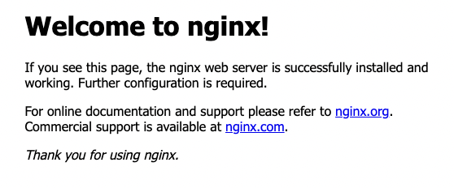
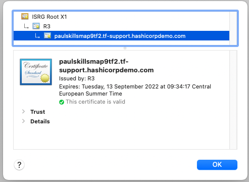

# skillsmap-infra-9
Skillsmap cloud/infra tab, exercise line 9

# Task
on AWS. 
create VPC. 
create 2 subnets, one for public network, one for private network. 
create internet gw and connect to public network. 
create nat gateway, and connect to private network. 
create ec2 instance without public ip, only private subnet. 
create a LB on https (check Application Load Balancer or Network Load Balancer). 
publish a service over LB, ie nginx http or https. 

# Usage
Git clone
```
git clone https://github.com/paulboekschoten/skillsmap-infra-9.git
```

Change directory
```
cd skillsmap-infra-9
```

# Check variables are correct in variables.tf  
Especially the cert_email, route53_zone and route53_subdomain.
```
variable "cert_email" {
  description = "email address used to obtain ssl certificate"
  type        = string
  default     = "paul.boekschoten@hashicorp.com"
}

variable "route53_zone" {
  description = "the domain to use for the url"
  type        = string
  default     = "tf-support.hashicorpdemo.com"
}

variable "route53_subdomain" {
  description = "the subdomain of the url"
  type        = string
  default     = "paulskillsmap9tf2"
}
```  
Replace the default values with the values you want to use.  

# Terraform init
```
terraform init
```
Sample output
```
Initializing the backend...

Initializing provider plugins...
- Finding latest version of hashicorp/tls...
- Finding vancluever/acme versions matching "2.8.0"...
- Finding latest version of hashicorp/aws...
- Using hashicorp/tls v3.4.0 from the shared cache directory
- Using vancluever/acme v2.8.0 from the shared cache directory
- Using hashicorp/aws v4.18.0 from the shared cache directory

Terraform has created a lock file .terraform.lock.hcl to record the provider
selections it made above. Include this file in your version control repository
so that Terraform can guarantee to make the same selections by default when
you run "terraform init" in the future.

Terraform has been successfully initialized!

...
```
  

# Terraform apply
```
terraform apply
```
Sample output
```
...

Plan: 30 to add, 0 to change, 0 to destroy.

Changes to Outputs:
  + dns = (known after apply)

Do you want to perform these actions?
  Terraform will perform the actions described above.
  Only 'yes' will be accepted to approve.

  Enter a value:
```
Answer with `yes` if your want to proceed.  

```
...

aws_acm_certificate.cert: Creating...
aws_acm_certificate.cert: Creation complete after 1s [id=arn:aws:acm:eu-west-3:323533494701:certificate/5a589389-0c52-4e6b-8306-53d22c5c8209]
aws_lb_listener.https: Creating...
aws_lb_listener.https: Creation complete after 0s [id=arn:aws:elasticloadbalancing:eu-west-3:323533494701:listener/app/paul-skillsmap-9-tf/8062830545394cd6/5b01a33ea2fd6b66]

Apply complete! Resources: 30 added, 0 changed, 0 destroyed.

```

# Output  
At the end you will also see an ouput  
```
Outputs:

dns = "paulskillsmap9tf2.tf-support.hashicorpdemo.com"
```
If you visit this link on http ([http://paulskillsmap9tf2.tf-support.hashicorpdemo.com/](http://paulskillsmap9tf2.tf-support.hashicorpdemo.com/)) or https ([https://paulskillsmap9tf2.tf-support.hashicorpdemo.com/](https://paulskillsmap9tf2.tf-support.hashicorpdemo.com/)) you should see this
  

With a valid certificate on https  
  

# TODO


# DONE
- [x] Change foreach to individual resources
- [x] Clarify readme
