"on AWS
create VPC
create 2 subnets, one for public network, one for private network
create internet gw and connect to public network
create nat gateway, and connect to private network
create ec2 instance without public ip, only private subnet
create a LB on https (check Application Load Balancer or Network Load Balancer)
publish a service over LB, ie nginx http or https"

Region: eu-west-3

# VPC
Go to VPC  
Create VPC  
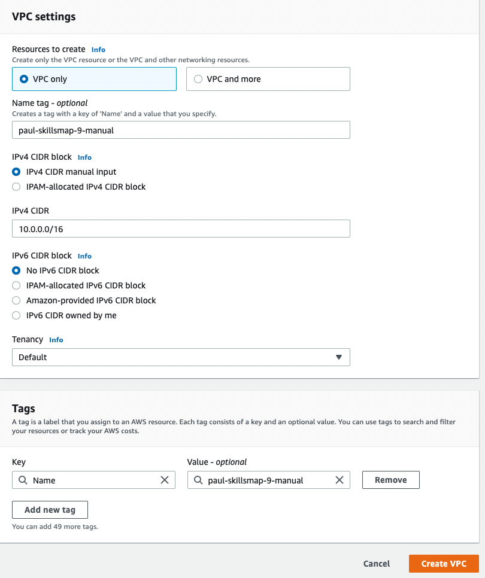  


# Subnets
Go to subnets  
Select newly created VPC  

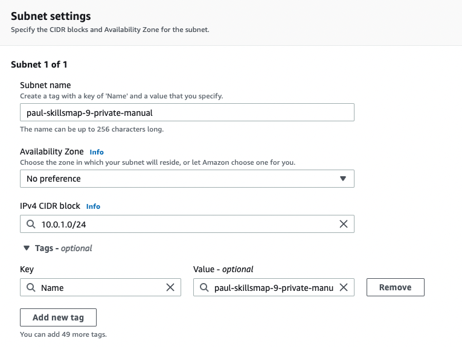  

Do the same for paul-skillsmap-9-public-manual with cidr range 10.0.2.0/24  
Do the same for paul-skillsmap-9-public2-manual with cidr range 10.0.3.0/24, select a different AZ to the previous one.  


# Internet Gateway
Go to Internet Gateways  
Create  
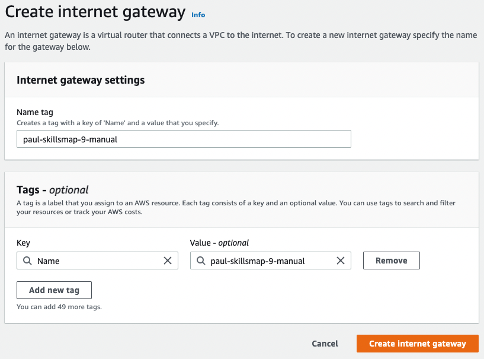  

 Under actions, click attach to VPC  
 Select your VPC and attach.  

 # NAT gateway
 Go to Nat Gateways  
 Create  
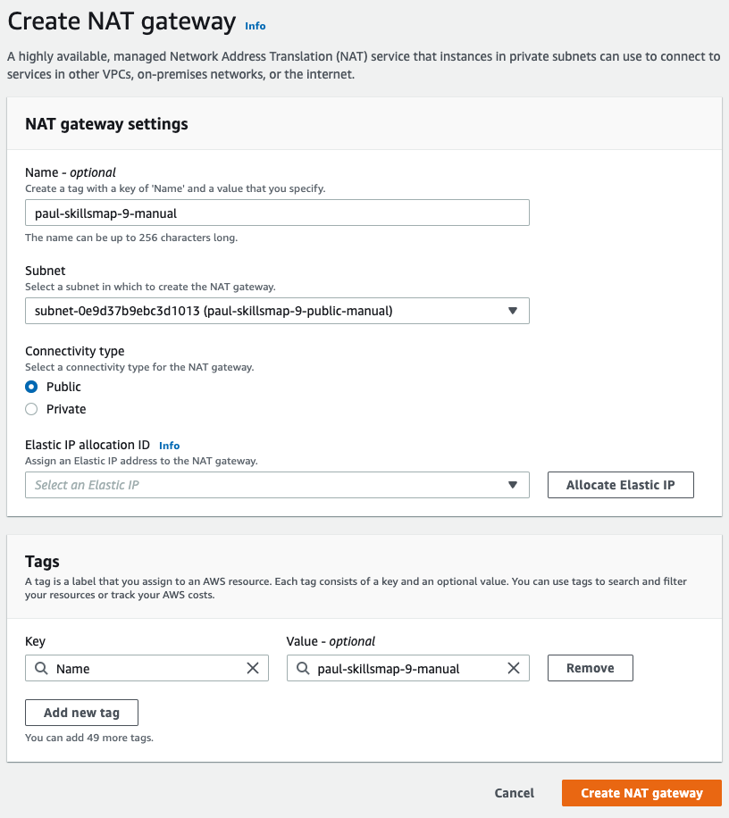    
 (Click Allocate Elastic IP to get a new public IP address.)  


# Security Groups
Go to Security Groups  
## public
Create  
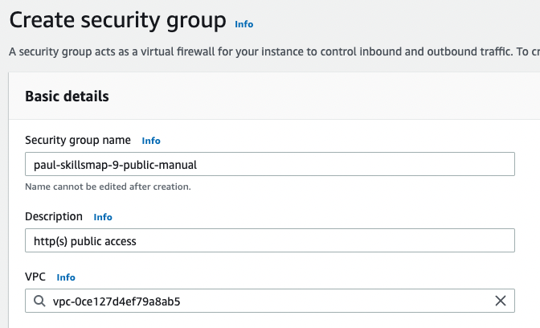    
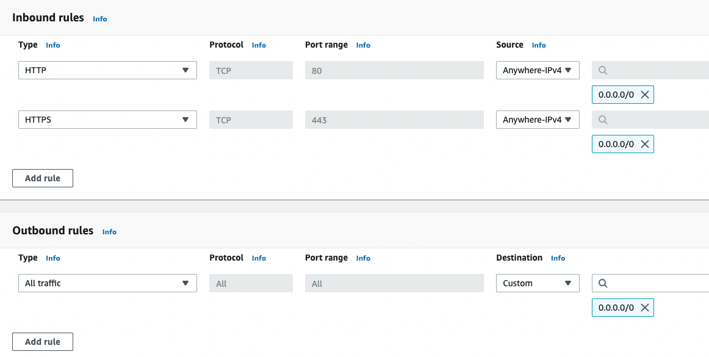  
## private
Create  
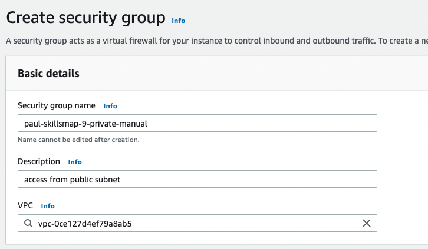  
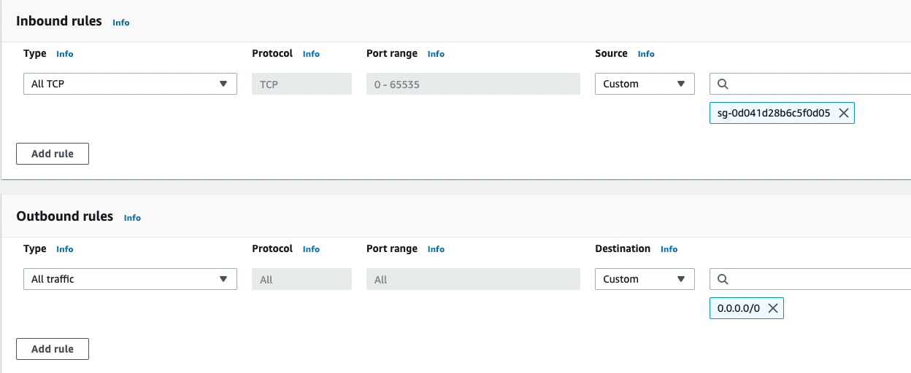  


# Key pair
Go to Key pairs  
Create  
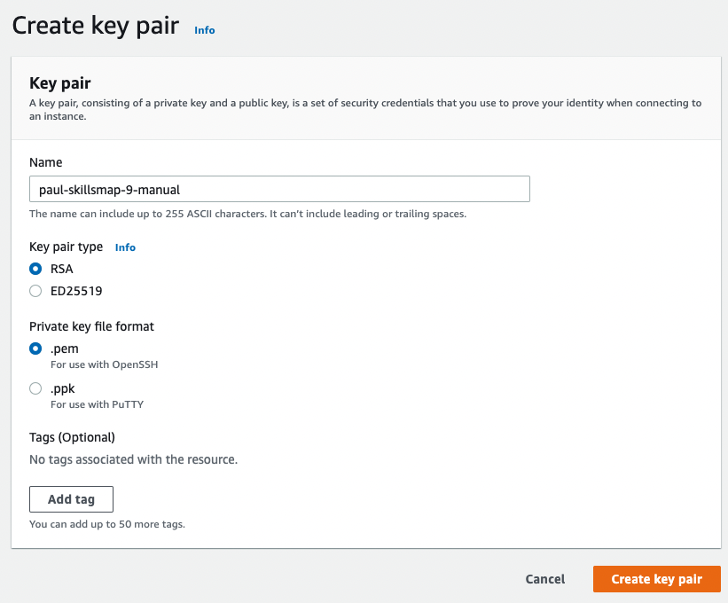  
(Save the pem file)


# EC2 instance
Go to Instances  
Launch   
  Name: paul-skillsmap-9-web-manual  
  Select: Ubuntu 22.04 (ami-0042da0ea9ad6dd83)  
  Instance type: t2.micro  
Select the created key pair  
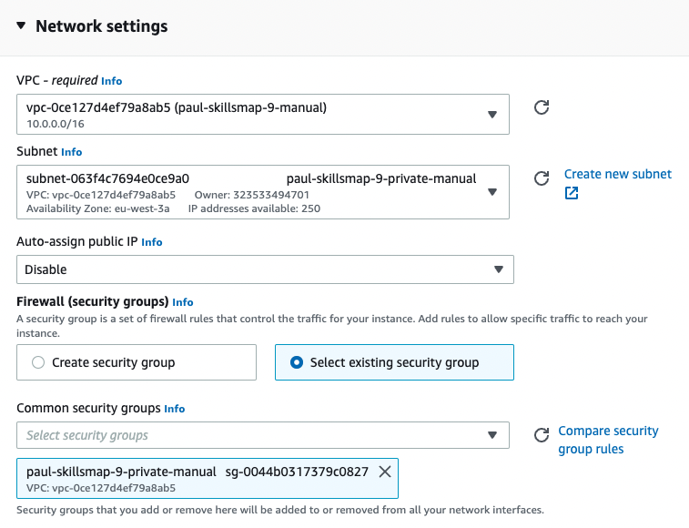  
Unfold Advanced details  
Under user data enter:
```
#!/bin/bash
sudo apt-get install -y nginx
```

# Route table
Go to Route tables  
Find the route table automatically created with VPC  
Add route:
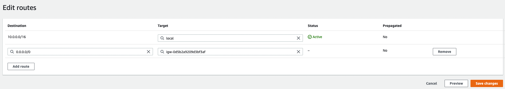  

Add another route table  
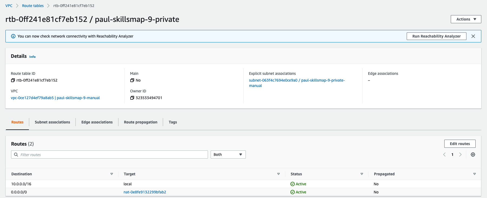  
Associate with the private subnet  
Add route to the NAT gateway  

# Target groups  
Go to Target Groups  
Create  
Select Instances  
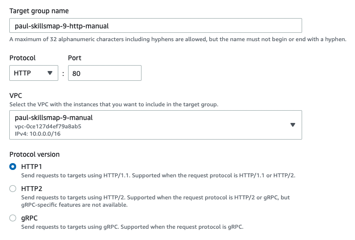  
Next  
Select the instance, click Include as pending  
Create  


# create DNS
Go to  Route 53, Hosted Zones, tf-support.hashicorpdemo.com  
Create  
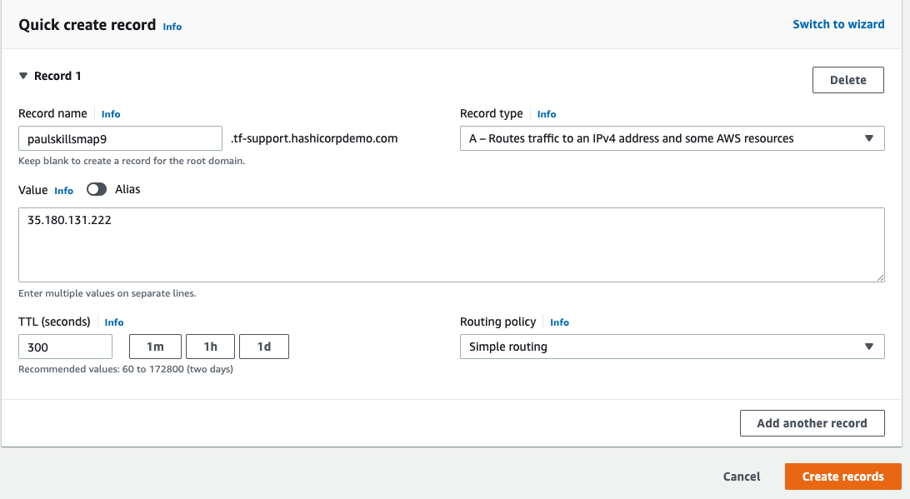
Note, the ip address does not match the loadbalancer, because it doesn't exist yet.  
This needs to be changed later when LB IP is known.  

# cert from let's encrypt
On a UNIX machine with certbot installed
```
sudo certbot -d paulskillsmap9.tf-support.hashicorpdemo.com --manual --preferred-challenges dns certonly --register-unsafely-without-email
```
Accept Terms  
Place the challenge in Route 53 as described  
Move the created files to an accessible location and make available for upload.  
Files will be available via shortcuts in a directory like 
```
/etc/letsencrypt/live/paulskillsmap9.tf-support.hashicorpdemo.com/
```

# Load balancer
Go to EC2 Load Balancers  
Create  
Select application load balancer  
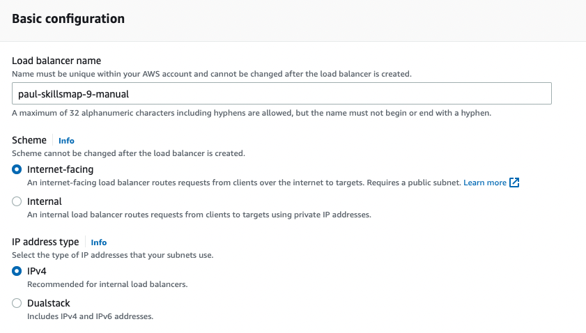  
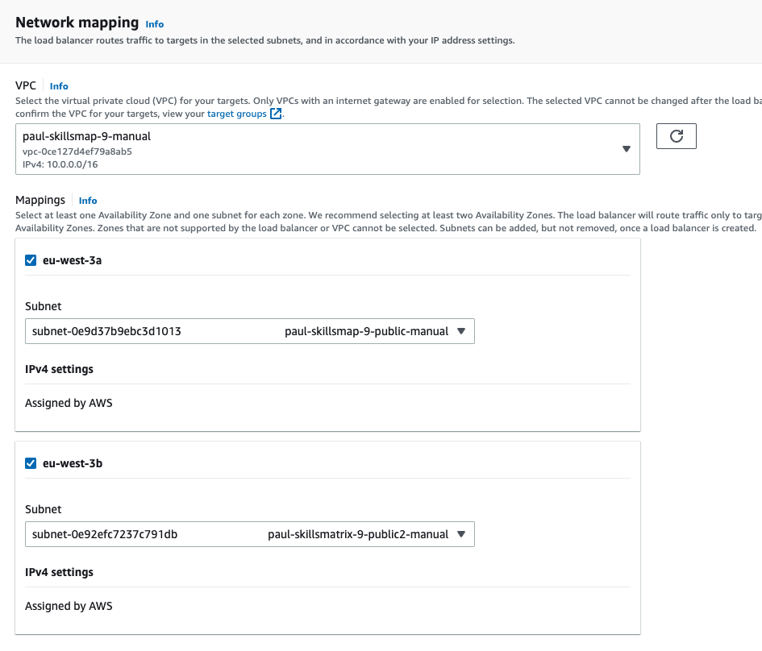  
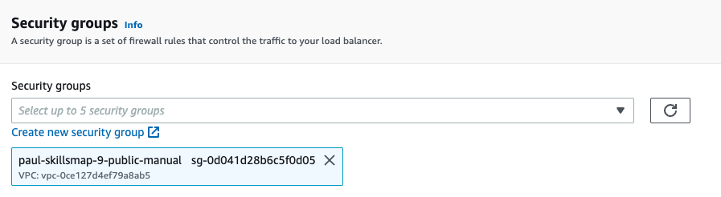  
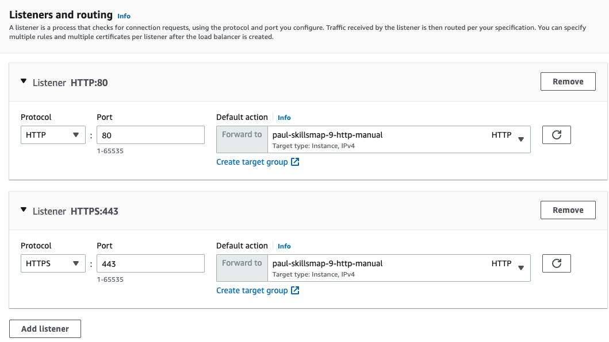  
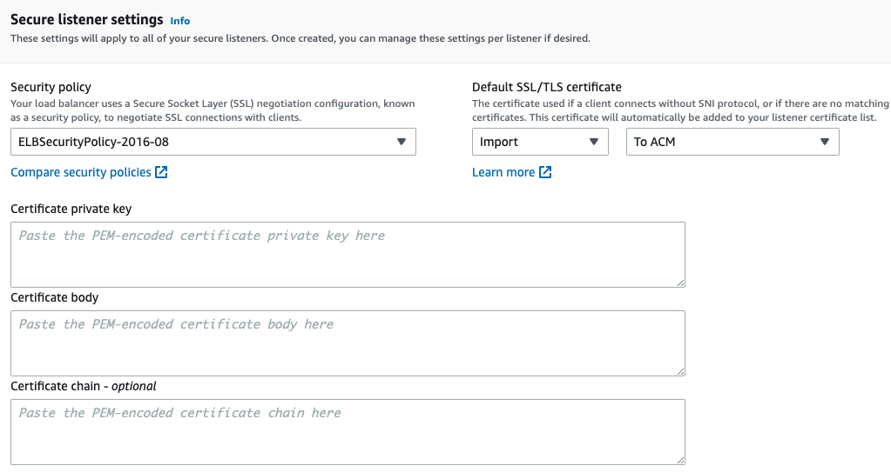  
(Paste the correct files from certbot in the corresponding boxes.)  

Create  

# Associate Target group with Loadbalancer
Go to the created target group
Under actions, click associate with existing loadbalancer  

# edit ip address of DNS
Go to the created DNS record and edit  
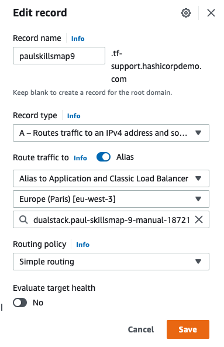  

